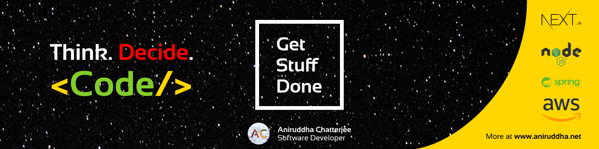

  

>

# Aniruddha Chatterjee

I am a pre-final year CSE student at SRM Institute of Science and Technology. I derive my daily dose of motivation from my passion and love for software development. I follow a logic driven, problem solving solving, which results in clean, maintainable and efficient code.

### My Field of Work

- Front-end using **React** and **Next.js**, leveraging **Tailwind CSS** or maybe **Bootstrap**.
- Back-end using **TypeScript** or **JavaScript** over **Node.js/Express**.
- Cloud computing, serverless architecture and more using **AWS**.
- Software development with **Java** and sometimes **Spring Boot**.

### My Projects

- [Papyrus](https://github.com/ruddha2001/papyrus-cli)  A simple CLI to transfer files to any device, right from the terminal. This project is made in TypeScript using the Oclif framework.
- [Billboard](https://github.com/srm-kzilla/billboard)  A simple OG Image generator that supports templates as well as custom images. Coded in TypeScript and Node.js/Express.
- [Patent Recommendation Engine](https://github.com/ruddha2001/ireadrx-recommendation-engine) This is a data mining project done as a part of my ML Engineering Internship at [iReadRx.ai](http://ireadrx.ai). It uses a Spring Boot backend and a Next.js client.
- [Springboard](https://github.com/srm-kzilla/springboard)  An initializer for JavaScript/TypeScript server and client to jumpstart project, written in TypeScript and Node.js/Express.

### My Work Experience

- **Software Engineer Intern** Ireadrx
- **Fullstack Engineer** IVentors Initiatives
- **Backend Developer** Sarthaka Foundation
